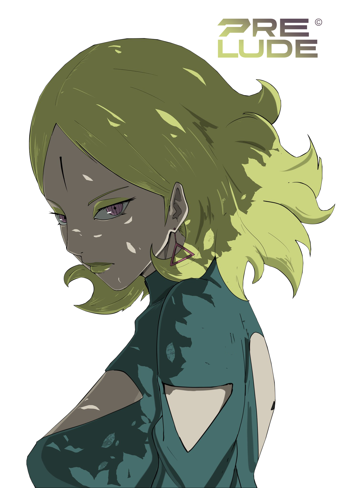

  

<h1 align="center">0x48 0x65 0x6c 0x6c 0x6f 0x2c 0x20 0x57 0x6f 0x72 0x6c 0x64 0x21 0x0a</h1>

Hello, World! — decoded, for anyone skimming this at 2am.

<h2 align="center">Jean Lucas (Race Condition)</h2>

  Computer Science student and hardware engineer at <strong>NETJAN</strong>, focused on chip design and functional verification (UVM).

  
  
  
  

---

### 🔭 Professional Overview

Computer Science student, currently a hardware engineer at NETJAN — a Vietnam-based hardware startup with partnerships across Japan, China, and Southeast Asia.

Focus: RTL design and functional verification (UVM). Independent study track, outside coursework: SystemVerilog, UVM, RISC-V processor design, and the calculus and semiconductor physics behind signal integrity, thermal dissipation, and timing.

📍 Full self-study roadmap — hardware/computer architecture and math/physics tracks: [`ROADMAP.md`](./ROADMAP.md).

🇧🇷 Ler em português

 

Estudante de Ciência da Computação, atualmente engenheiro de hardware na NETJAN — startup de hardware baseada no Vietnã, com parcerias no Japão, China e Sudeste Asiático.

Foco: RTL design e verificação funcional (UVM). Trilha de estudo independente, fora da grade: SystemVerilog, UVM, design de processador RISC-V, e o cálculo e física de semicondutores por trás de integridade de sinal, dissipação térmica e temporização.

